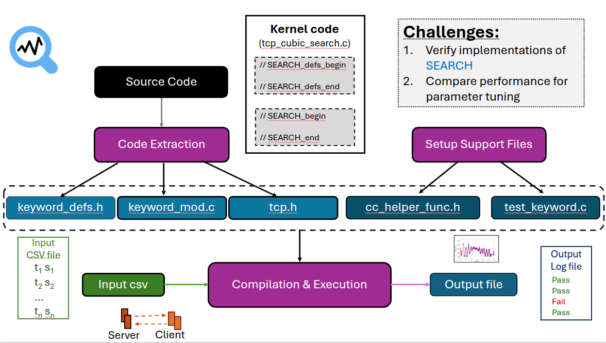

# Search Test Framework - Version 1
This is the first version of the Search Test Framework, designed to test the functionality of the SEARCH algorithm using a mock implementation. The framework processes input data from a CSV file and runs the search_update function on the data.

